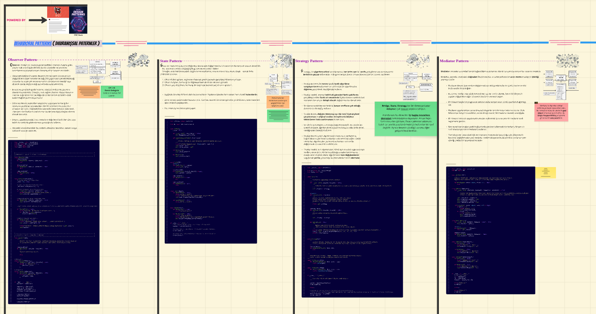

# Advanced Python Concepts & Patterns

This repository contains **advanced Python programming concepts, design patterns, and performance/parallelization techniques**.  
The projects are **inspired by Refactoring Guru’s [Design Patterns](https://refactoring.guru/design-patterns)**, and each topic highlights relevant design patterns, Python features, and practical examples.

## Design Patterns Miro (click)

